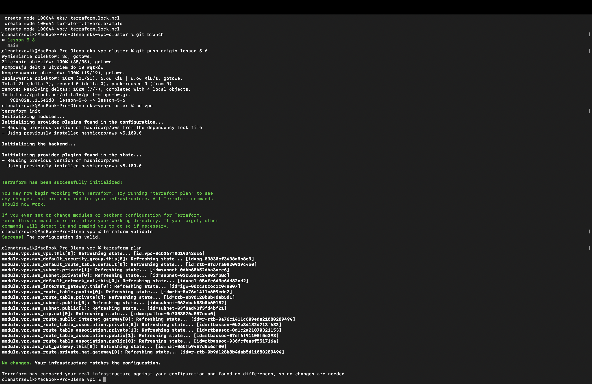
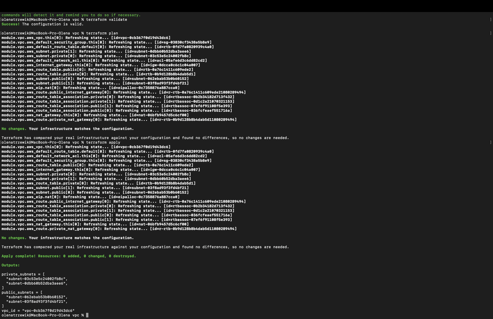
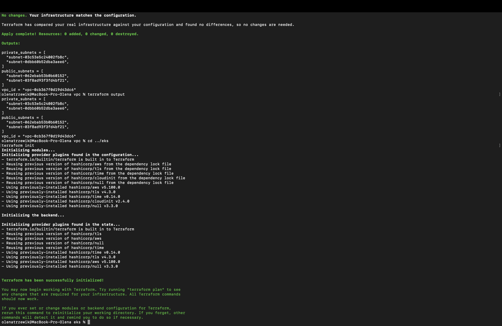
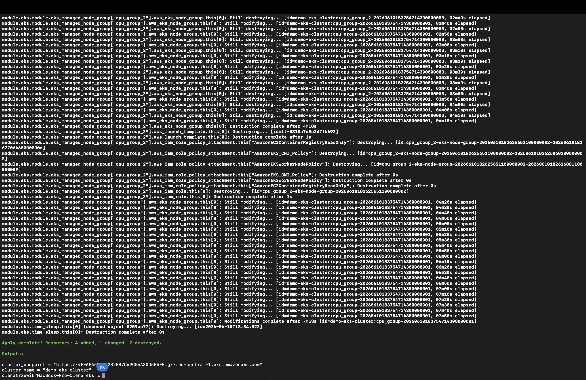
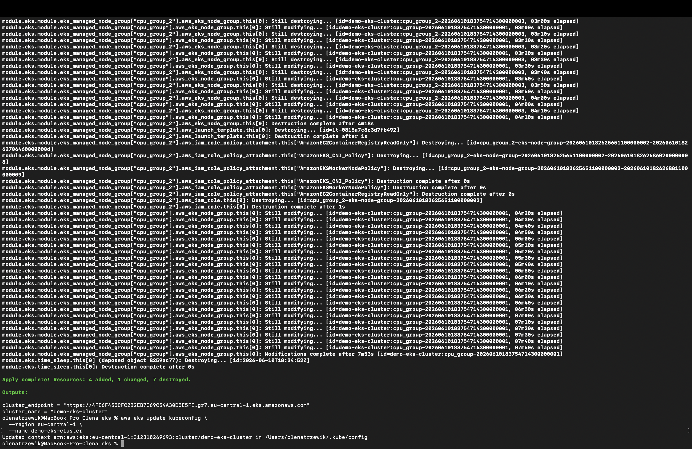
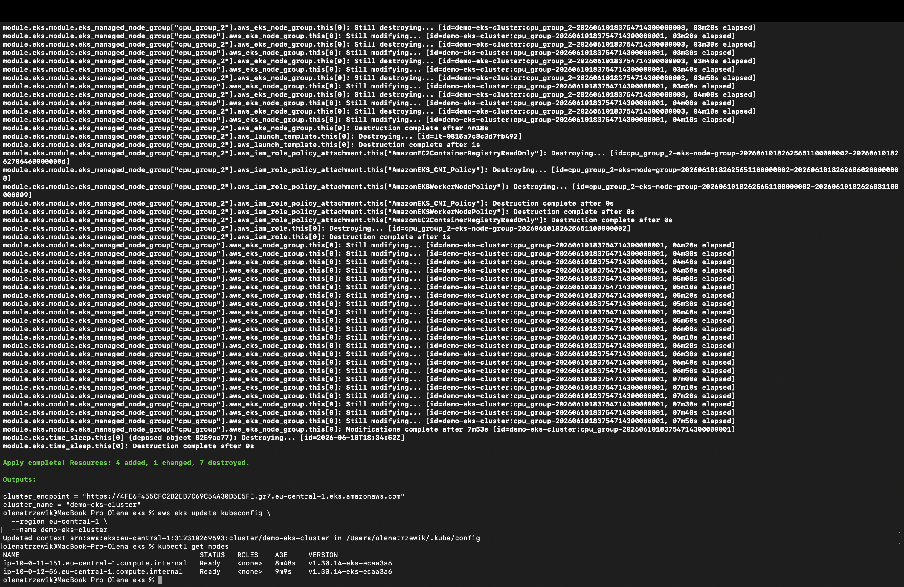
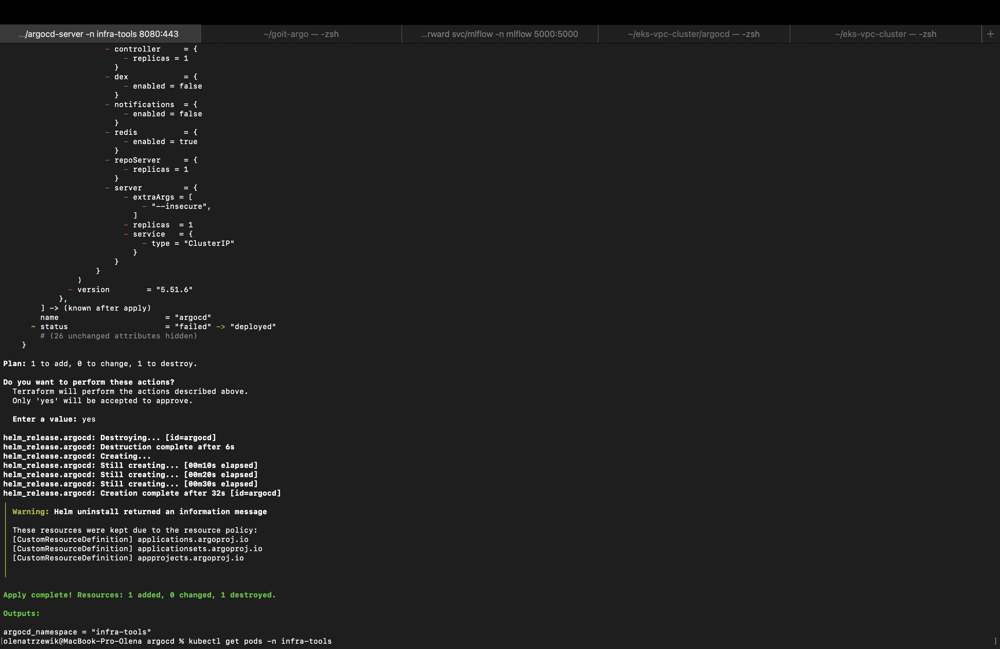
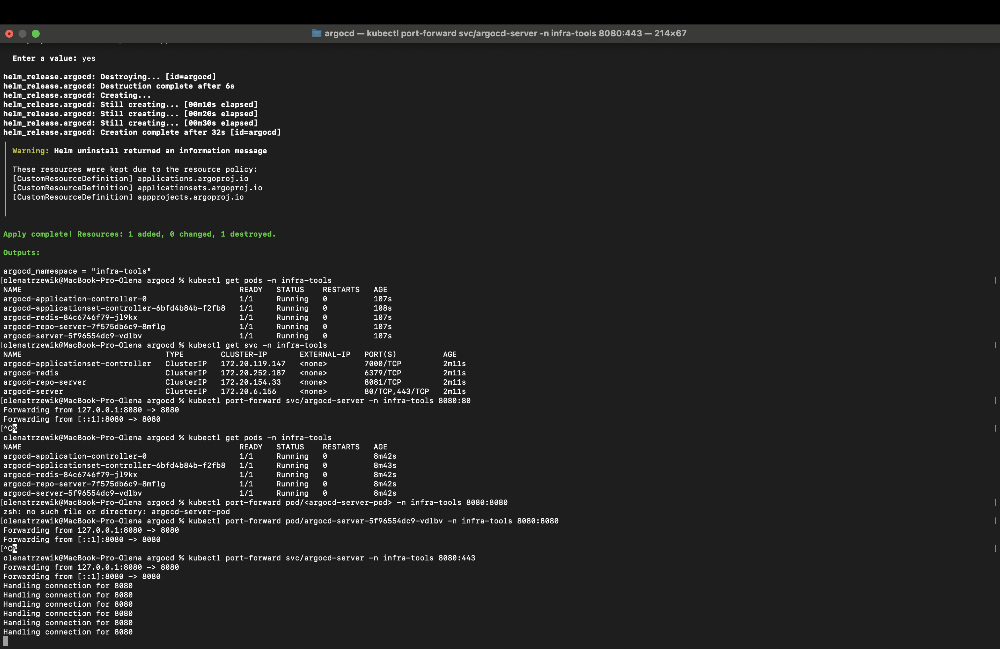
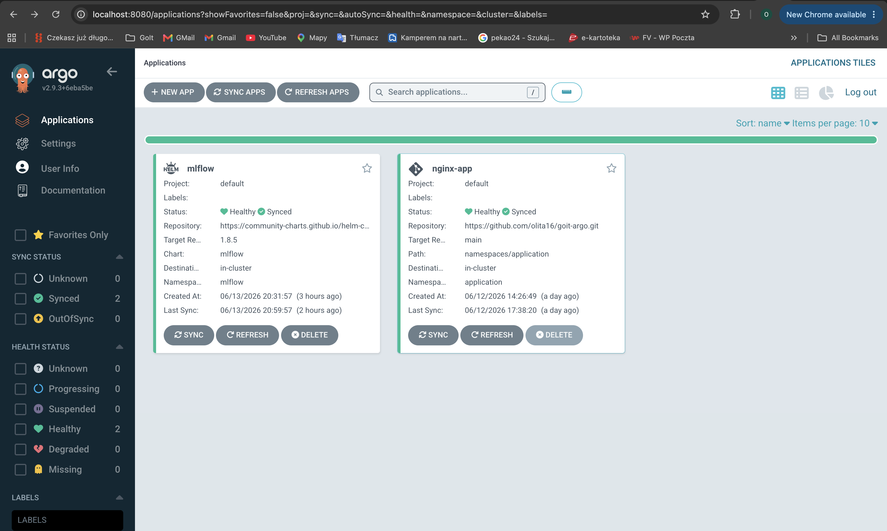

# Terraform Infrastructure: VPC + EKS Cluster

Цей проєкт демонструє розгортання повноцінної AWS інфраструктури за допомогою Terraform з використанням модульної архітектури.

---

## Структура проєкту

```
eks-vpc-cluster/
├── main.tf
├── variables.tf
├── outputs.tf
├── terraform.tf
├── backend.tf
├── vpc/
│   ├── main.tf
│   ├── variables.tf
│   ├── outputs.tf
│   ├── terraform.tf
│   └── backend.tf
├── eks/
│   ├── main.tf
│   ├── variables.tf
│   ├── outputs.tf
│   ├── terraform.tf
│   └── backend.tf
├── argocd/ 
│   ├── main.tf 
│   ├── variables.tf 
│   ├── outputs.tf 
│   ├── terraform.tf 
│   ├── backend.tf 
│   └── values/ 
│      └── argocd-values.yaml
└── README.md
```

---

## Мета проєкту

- Використання модульної структури Terraform
- Автоматичне створення VPC через офіційний модуль
- Розгортання EKS-кластера всередині VPC
- Створення двох node group (CPU workloads)
- Робота з `terraform_remote_state`, outputs та providers
- Підключення до Kubernetes через `kubectl`
- Розгортання ArgoCD у Kubernetes через Terraform 
- Налаштування GitOps підходу для автоматичного деплою застосунків

---

## Використані технології

- Terraform >= 1.5
- AWS (VPC, EKS, S3)
- kubectl
- AWS CLI
- Argo CD

---

## Вимоги

Перед запуском переконайтесь, що встановлено:

- AWS CLI (`aws configure`)
- Terraform
- kubectl
- IAM користувач з правами: EKS, VPC, S3

---

##  Розгортання

### 1. Ініціалізація VPC

```bash
cd vpc
terraform init
```


```bash
terraform apply
```



---

### 2. Ініціалізація EKS

```bash
cd eks
terraform init
```


```bash
terraform apply
```


---

### 3. Налаштування kubectl

```bash
aws eks update-kubeconfig \
  --region eu-central-1 \
  --name demo-eks-cluster
```


---

### 4. Перевірка кластера

```bash
kubectl get nodes
```


---

### 5. Налаштування ArgoCD

```bash
cd argocd 
terraform init 
terraform apply
```


Після успішного розгортання перевірка кількості подів, сервісів у namespace infra-tools, :

```bash
kubectl get pods -n infra-tools
kubectl get svc -n infra-tools
```


---

## Доступ до веб-інтерфейсу ArgoCD

Для доступу до веб-інтерфейсу ArgoCD необхідно виконати port-forward через Kubernetes Service:

```bash 
kubectl port-forward svc/argocd-server -n infra-tools 8080:443
```

Після встановлення port-forward веб-інтерфейс ArgoCD буде доступний за адресою:

https://localhost:8080


Оскільки ArgoCD використовує самопідписаний SSL-сертифікат, браузер може відобразити попередження про безпеку. У такому випадку необхідно обрати:

Додатково → Перейти на localhost (небезпечний сайт)

Початковий пароль користувача admin можна отримати за допомогою команди::

```bash 
kubectl -n infra-tools get secret argocd-initial-admin-secret \ -o jsonpath="{.data.password}" | base64 --decode
```
---

## Git-репозиторій з ArgoCD Application

Конфігурація GitOps-деплою застосунку **MLflow** зберігається в окремому Git-репозиторії:

```
https://github.com/olita16/goit-argo-mlflow

```

Основні файли репозиторію:

* `application.yaml` — опис ресурсу **ArgoCD Application**, який визначає джерело Helm-чарту, налаштування синхронізації та цільовий namespace для деплою застосунку;
* `values/mlflow-values.yaml` — кастомні значення Helm-чарту MLflow, що містять конфігурацію ресурсів, сервісу та інших параметрів застосунку;
* `README.md` — інструкції щодо перевірки роботи застосунку та доступу до веб-інтерфейсу MLflow.

ArgoCD автоматично відстежує зміни у Git-репозиторії та виконує синхронізацію Kubernetes-кластера відповідно до принципів **GitOps**. Після внесення змін до конфігурації та виконання `git push` застосунок автоматично оновлюється в кластері.



---


## Архітектура

- VPC створено через офіційний Terraform модуль
- EKS розгорнуто всередині VPC
- Node groups:
  - CPU nodes (t3.micro)
  - додаткові workload групи
- Remote state зберігається у S3
- ArgoCD розгорнуто через Terraform Helm Release у namespace `infra-tools` 
- Значення Helm-чарту ArgoCD винесені в `argocd-values.yaml` - ArgoCD використовується для GitOps-деплою застосунків

---

## S3 Backend

```
tf-state-olena-eks-2026/
├── vpc/
├── eks/
└── argocd/
```

---

## Outputs

Після `terraform apply` доступні:

- VPC ID
- Subnets
- Cluster endpoint
- Cluster name

---

## Перевірка роботи

```bash
terraform plan
terraform apply
terraform output
```

---

## Очищення інфраструктури

```bash
terraform destroy
```

---

## Результат

Після успішного застосування описаних вище команд результат є наступним:

- Створено VPC інфраструктуру
- Розгорнуто EKS кластер
- Доступ через kubectl налаштовано
- Node groups працюють і доступні
- Розгорнуто ArgoCD у namespace `infra-tools`
- GitOps підхід налаштовано для автоматичного деплою застосунків


---

## Примітка

Проєкт використовує модульну архітектуру та best practices Terraform для масштабованих AWS рішень.