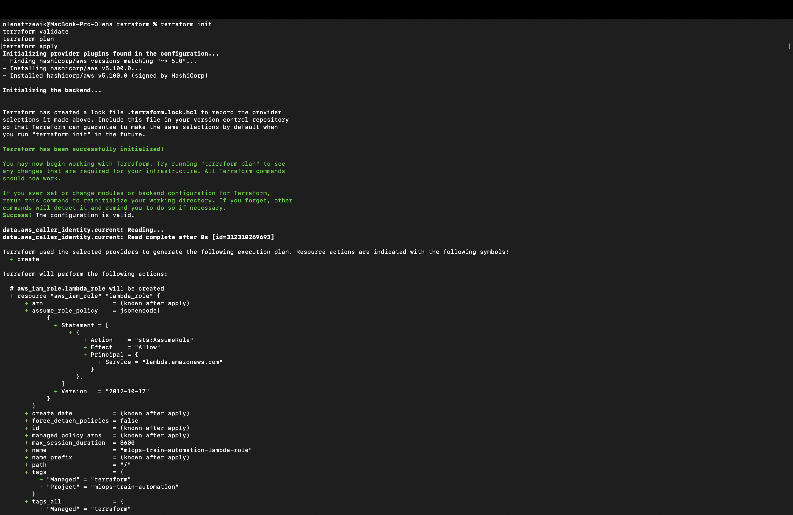
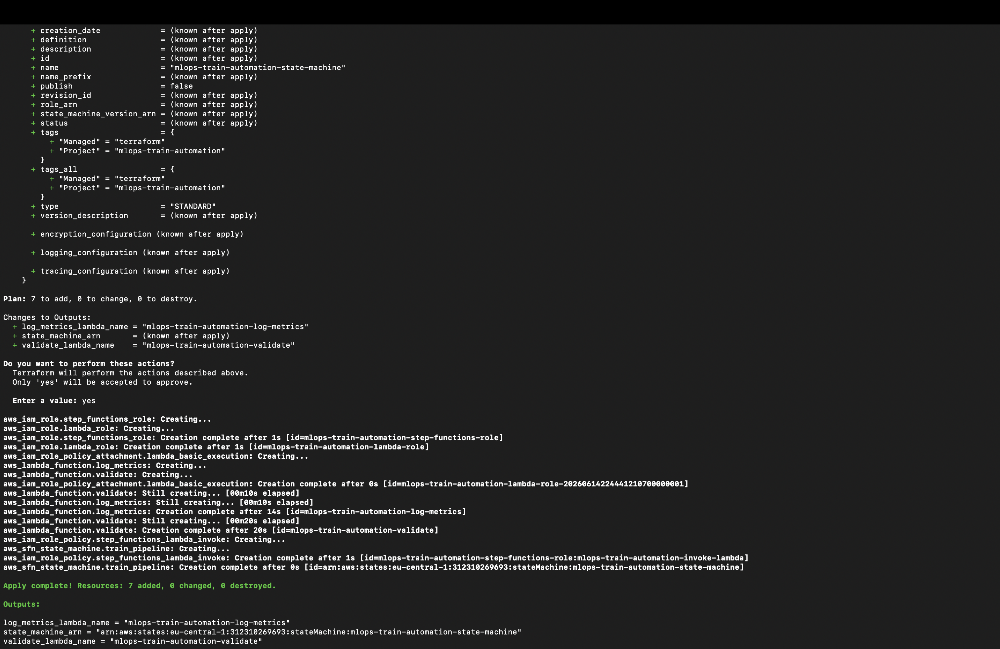
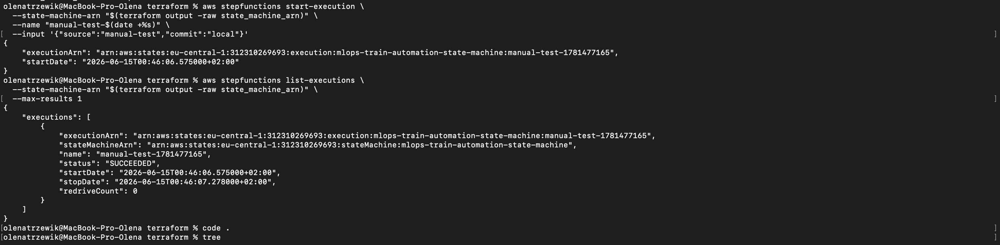
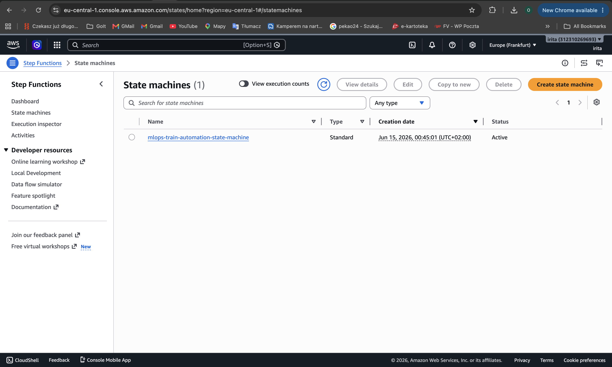
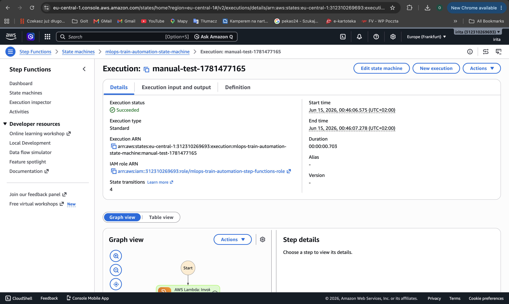

# Автоматизоване тренування моделей

## Опис проєкту

У межах цього завдання реалізовано автоматизацію процесу тренування ML-моделей за допомогою сервісів AWS та інструментів MLOps.

Рішення побудоване з використанням:

- **AWS Lambda** — для виконання окремих етапів пайплайну;
- **AWS Step Functions** — для оркестрації послідовного виконання кроків;
- **Terraform** — для опису та розгортання інфраструктури як коду (Infrastructure as Code);
- **GitLab CI/CD** — для автоматичного запуску процесу тренування після виконання `push` до репозиторію.

---

## Мета роботи

У рамках завдання було виконано:

- створено AWS Step Function для запуску пайплайну тренування моделі;
- реалізовано Lambda-функції для окремих етапів процесу;
- описано всю інфраструктуру за допомогою Terraform;
- налаштовано GitLab CI/CD для автоматичного запуску Step Function.

---

## Архітектура рішення

Пайплайн складається з двох послідовних етапів:

1. **ValidateData** — валідація вхідних даних;
2. **LogMetrics** — логування метрик тренування.

Схема роботи:

```text
GitLab Push
     ↓
GitLab CI/CD Pipeline
     ↓
AWS Step Functions
     ↓
ValidateData (Lambda)
     ↓
LogMetrics (Lambda)
     ↓
Execution Succeeded
```

---

## Структура проєкту

```text
mlops-train-automation/
├── terraform/
│   ├── main.tf
│   ├── variables.tf
│   └── lambda/
│       ├── validate.py
│       ├── log_metrics.py
│       ├── validate.zip
│       └── log_metrics.zip
├── .gitlab-ci.yml
└── README.md
```

---

## Lambda-функції

### validate.py

Lambda-функція виконує умовну валідацію даних.

Приклад реалізації:

```python
def lambda_handler(event, context):
    print("Validating data...")
    return {
        "statusCode": 200,
        "message": "Validation completed"
    }
```

### log_metrics.py

Lambda-функція виконує умовне логування метрик.

Приклад реалізації:

```python
def lambda_handler(event, context):
    print("Logging metrics...")
    return {
        "statusCode": 200,
        "message": "Metrics logged"
    }
```

---

## Збірка Lambda ZIP архівів

Перед розгортанням інфраструктури необхідно створити ZIP-архіви Lambda-функцій.

Перейдіть у директорію:

```bash
cd terraform/lambda
```

Створіть архіви:

```bash
zip validate.zip validate.py
zip log_metrics.zip log_metrics.py
```

Перевірте наявність архівів:

```bash
ls -la *.zip
```

Очікуваний результат:

```text
validate.zip
log_metrics.zip
```

---

## Розгортання інфраструктури через Terraform

Terraform використовується для створення:

- IAM ролі для Lambda;
- IAM ролі для AWS Step Functions;
- Lambda-функції `ValidateData`;
- Lambda-функції `LogMetrics`;
- Step Function із двома послідовними етапами.

### Ініціалізація Terraform

```bash
cd terraform
terraform init
terraform plan
terraform apply
```


Після підтвердження та успішного виконання буде виведено:

```text
Apply complete!
```

та створено outputs:

```text
state_machine_arn
validate_lambda_name
log_metrics_lambda_name
```





---

## Ручний запуск Step Function

Отримайте ARN Step Function:

```bash
terraform output -raw state_machine_arn
```

Запустіть виконання вручну:

```bash
cd terraform

aws stepfunctions start-execution \
  --state-machine-arn "$(terraform output -raw state_machine_arn)" \
  --name "manual-test-$(date +%s)" \
  --input '{"source":"manual-test","commit":"local"}'
```

Успішне виконання:

```json
{
  "executionArn": "arn:aws:states:eu-central-1:xxxxxxxxxxxx:execution:mlops-train-automation-state-machine:manual-test-123456",
  "startDate": "2026-06-15T00:46:06.575000+02:00"
}
```


---

## Перевірка Step Function через AWS Console

Для перевірки успішного виконання:

1. Відкрити AWS Console.
2. Обрати регіон **Europe (Frankfurt) – eu-central-1**.
3. Перейти до сервісу **Step Functions**.
4. Відкрити State Machine:
5. Перейти у вкладку **Executions**.
6. Відкрити останнє виконання.
7. Переконатися, що статус виконання:

```text
Succeeded
```





---

## GitLab CI/CD

У проєкті налаштовано автоматичний запуск Step Function після виконання `push`.

Файл `.gitlab-ci.yml` містить job:

```yaml
train-model:
  stage: train
  image: amazon/aws-cli:2.15.0

  script:
    - aws stepfunctions start-execution \
      --state-machine-arn "$STEP_FUNCTION_ARN" \
      --name "train-$(date +%s)" \
      --input '{"source":"gitlab-ci","commit":"'$CI_COMMIT_SHORT_SHA'"}'
```

### Принцип роботи GitLab CI

1. Розробник виконує `git push`.
2. GitLab запускає pipeline.
3. Виконується job `train-model`.
4. За допомогою AWS CLI викликається `aws stepfunctions start-execution`.
5. AWS Step Functions запускає ML pipeline.
6. Послідовно виконуються Lambda-функції.

---

## Необхідні GitLab CI/CD Variables

У GitLab необхідно додати наступні змінні:

| Variable | Description |
|-----------|-------------|
| `AWS_ACCESS_KEY_ID` | AWS Access Key |
| `AWS_SECRET_ACCESS_KEY` | AWS Secret Access Key |
| `AWS_DEFAULT_REGION` | AWS Region |
| `STEP_FUNCTION_ARN` | ARN створеної Step Function |

Приклад:

```text
AWS_DEFAULT_REGION=eu-central-1
```

ARN можна отримати командою:

```bash
terraform output -raw state_machine_arn
```

---

## JSON, що передається через GitLab CI

Під час запуску пайплайну передаються параметри у форматі JSON.

Приклад:

```json
{
  "source": "gitlab-ci",
  "commit": "abc123"
}
```

Де:

- `source` — джерело запуску пайплайну;
- `commit` — короткий SHA коміту (`CI_COMMIT_SHORT_SHA`).

---

## Результати виконання

У рамках виконання завдання було реалізовано:

- AWS Step Function із двома етапами:
  - ValidateData;
  - LogMetrics;
- Lambda-функції на Python;
- ZIP-архіви Lambda-функцій;
- Terraform-конфігурацію для повного розгортання інфраструктури;
- автоматичний запуск Step Function через GitLab CI/CD;
- передачу параметрів через JSON;
- успішне виконання пайплайну.

---

## Видалення ресурсів

Для видалення створеної інфраструктури:

```bash
cd terraform
terraform destroy
```

Підтвердьте виконання:

```text
yes
```

Після завершення всі AWS ресурси будуть видалені.